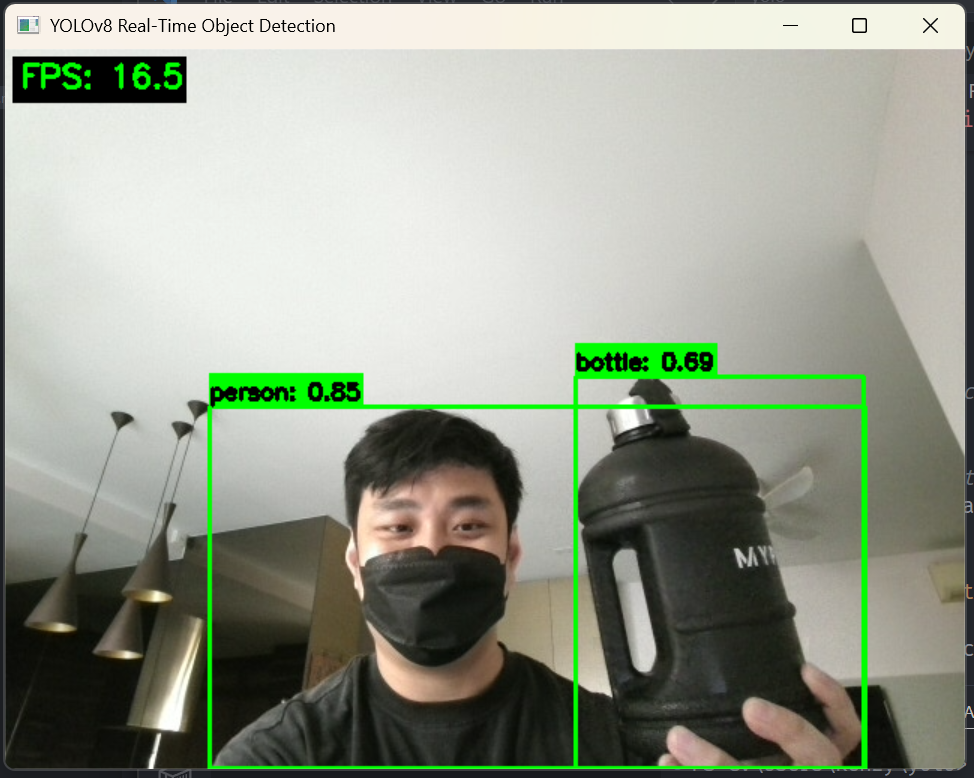

# YOLOv8 Real-Time Object Detection



Real-time object detection using YOLOv8 nano model with CUDA acceleration. Captures video from laptop webcam and displays bounding boxes for detected objects at 30+ FPS.

## Features

- YOLOv8n (nano) model for fast inference
- CUDA GPU acceleration (falls back to CPU if unavailable)
- Real-time webcam feed with bounding boxes and labels
- Detects all 80 COCO classes (person, car, dog, etc.)
- Live FPS counter with smoothing
- ~1-2GB VRAM usage (tested on NVIDIA GPU)

## Requirements

- Python 3.13+
- NVIDIA GPU with CUDA 12.8 support (optional but recommended)
- Webcam access

## Installation

1. Clone or download this repository

2. Install dependencies using uv:
```bash
uv sync
```

Or manually install:
```bash
uv add ultralytics opencv-python torch torchvision torchaudio
```

## Usage

### Windows

Open PowerShell or Command Prompt in the project directory:

```powershell
# Sync dependencies
uv sync

# Run the detector
uv run python main.py
```

**If you encounter .venv issues on Windows:**
```powershell
Remove-Item -Recurse -Force .venv
uv sync
```

### Linux / macOS

Open terminal in the project directory:

```bash
# Sync dependencies
uv sync

# Run the detector
uv run python main.py
```

**If you encounter .venv issues:**
```bash
rm -rf .venv
uv sync
```

### Using System Python (Alternative)

If you prefer to use your system Python installation instead of uv:

```bash
# Create virtual environment
python -m venv .venv

# Activate virtual environment
# Windows PowerShell:
.venv\Scripts\Activate.ps1
# Linux/Mac:
source .venv/bin/activate

# Install dependencies
pip install -r <(uv pip compile pyproject.toml)
# Or manually:
pip install ultralytics opencv-python torch torchvision torchaudio --index-url https://download.pytorch.org/whl/cu128

# Run
python main.py
```

### First Run

On first run, YOLOv8n model weights (~6MB) will be downloaded automatically.

## Controls

- **ESC** or **q** - Exit the program
- The webcam window will show real-time detections with green bounding boxes

## Output

```
Using device: cuda
GPU: [Your GPU Name]
Loading yolov8n.pt...
Model loaded successfully!
Webcam initialized successfully!

Starting real-time object detection...
Press ESC or 'q' to exit

Warming up model...
Warmup complete!
```

A window will open showing the webcam feed with:
- Green bounding boxes around detected objects
- Class labels and confidence scores
- FPS counter in the top-left corner

## Performance

- **Expected FPS**: 30-45 FPS on modern NVIDIA GPU
- **VRAM Usage**: ~1-2GB
- **Model**: YOLOv8n (nano) - optimized for speed
- **Resolution**: 640x480 default

## Troubleshooting

### "Could not open webcam" error

**WSL Users**: WSL doesn't have direct access to Windows hardware devices. You must run the script from Windows PowerShell or Command Prompt:
```powershell
cd C:\Users\YOUR_USERNAME\YOLOv8
uv run python main.py
```

**Linux Users**: Ensure your user is in the `video` group:
```bash
sudo usermod -a -G video $USER
# Log out and back in for changes to take effect
```

**macOS Users**: Grant terminal/Python permission to access the camera in System Preferences > Security & Privacy > Camera.

**Permission Issues (Windows)**: Ensure camera permissions are enabled in Windows Settings > Privacy > Camera.

### ".venv\lib64: Access is denied"

This is a Windows symlink issue. Remove and recreate the virtual environment:
```powershell
Remove-Item -Recurse -Force .venv
uv sync
```

### CUDA not available

If you see `Using device: cpu`, ensure:
1. NVIDIA drivers are installed
2. CUDA toolkit is compatible with PyTorch
3. GPU is not being used by another process

You can still run on CPU, but expect lower FPS (~5-10 FPS).

## Technical Details

### Model

- **YOLOv8n**: Smallest and fastest YOLO variant
- **Input size**: 640x640 (auto-resized from webcam feed)
- **Confidence threshold**: 0.5 (adjustable in code)
- **Classes**: 80 COCO dataset classes

### Architecture

```
WebcamObjectDetector
├── __init__()          # Load model, check CUDA
├── initialize_camera() # Setup webcam capture
├── run_inference()     # YOLO prediction on GPU
├── draw_detections()   # Render boxes and labels
├── calculate_fps()     # Track performance
└── run()              # Main detection loop
```

### Dependencies

- `ultralytics` - Official YOLOv8 implementation
- `opencv-python` - Webcam capture and display
- `torch` - PyTorch with CUDA 12.8
- `torchvision` - Vision utilities
- `torchaudio` - Audio processing (PyTorch dependency)

## Configuration

Edit `main.py` to adjust settings:

```python
detector = WebcamObjectDetector(
    model_name="yolov8n.pt",  # Try yolov8s.pt for better accuracy
    confidence=0.5             # Lower for more detections, higher for precision
)
```

## License

This project uses YOLOv8 from Ultralytics, which is licensed under AGPL-3.0.
